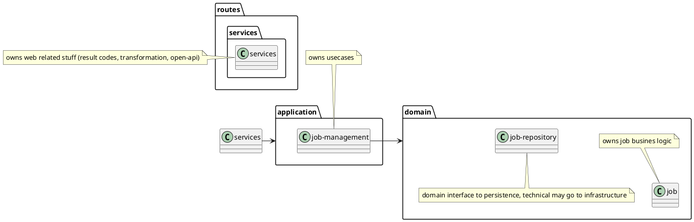
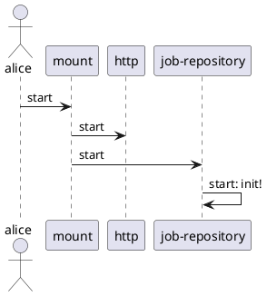
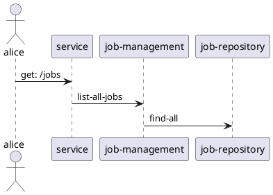

## 2. A simple HTTP API

### Objective

We define a mock JSON HTTP API for a minimalist job board
application. The API exposes the following routes:

- `GET /jobs`: Returns a map of open positions in the job board.
- `POST /jobs`: Inserts a new open position in the job board and
  returns the updated map.
- `DELETE /jobs/:id`: Removes an open position from the job board and
  returns the updated map.

Job IDs should be textual representations of UUIDs. Jobs should have
a `company`, `title`, and `description` field.

### Assignment details

The project should be delivered as a [leiningen](http://leiningen.org)
project, starting the API server on `localhost` port `8080` when
launched with `lein run`.

Storage of jobs should be limited to in-memory, and functional
boundaries should be split across clearly defined components within
the daemon.

No automated tests will be ran, and attention will be given to choices
made in terms of dependencies and code architecture.

### Comments
1. As I have much more practice in java/spring rest-development I decided to follow @yogthos@mastodon.social recomentation found his new book "Web Development with Clojure". Csfr, error-handling, logging is already included. Several auth optiona are available. The setup feels good after first experiment :-)
2. I assume "mock" means the domain logic should be mocked. In order to have a foundation on discussing about clojure web services I have choosen a production-good-enough setup, but without the finishing & hardening steps.
3. Components in my setup I know and like are:
    1. [cheshire "5.10.0"] / [luminus-transit "0.1.2"] for low-lovel data transformation support
    2. [cprop "0.1.17"] - for configuration. As alternative I apreciate juxt/aero. I tend to a deeper comparison of them both in next future.
    3. jetty - a well known webserver, necer be a pioneer without need
    4. [markdown-clj "1.10.5"] & [selmer "1.12.31"] - yogthos templating tools, I like them and have used them a lot.
    5. ring - the well known http middleware
    6. [mount "0.1.16"] - support components lifecycles
    7. metosin/reitit & data-spec - support for openapi-spec & data handling.   
        Swagger-ui is provided at: http://localhost:8080/swagger-ui
4. Architecture follows the Luminus-Architectur on the web-server side & DomainDrivenDesign on the domain side.
    1. Aspect Validation:
        1. atmo validation in routes.services (using data-spec) and validation in jobs namespace not on same code base. In production systems I would invest work to use the same validation code-base placed in domain. Validation should be part of domain. Data-spec seems to be compatible to spec, so same code-base seems possible.
        1. To ensure valid domain objects I put the validation quality gates on application- and on repository-layer. Maybe it is good enough to do good validation one layer erleir on "routes.service".
    2. Aspect luminus project layout vs. DDD layout: DDD would put all webserver related stuff in an infrastructure namespace. As I not know how large this refactoring is I accepted the luminus layout outside of application / domain / (infrastrucute for futher repository stuff).
    3. Dependency Injection: I think DI is not as important on clojure as it is on OOLaguages. But for large systems DI may get important also. I found here a good discussion about: https://www.juxt.pro/blog/abstract-clojure   
    If system goes to provide plugin style extensions, DI done by multimethod might be a good solution also. I tried this with success here: https://github.com/DomainDrivenArchitecture/dda-pallet/blob/4734582682a94ca119e9b1f918ba676cdd8699d4/main/src/dda/pallet/core/infra.clj#L53 and https://github.com/DomainDrivenArchitecture/dda-pallet/blob/4734582682a94ca119e9b1f918ba676cdd8699d4/main/src/dda/pallet/dda_config_crate/infra.clj#L25

### Architecture
#### combine Luminus & DDD

#### Server-init

#### Get: /jobs

