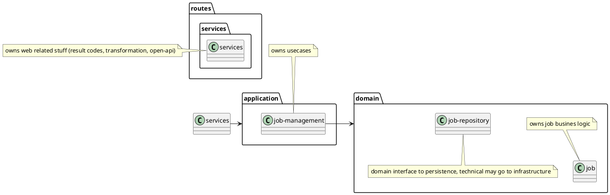
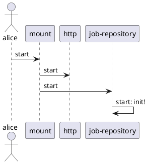
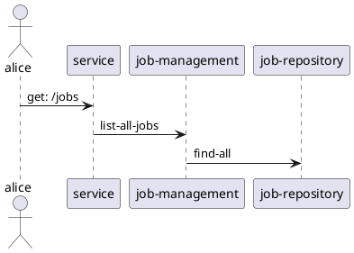

## 2. A simple HTTP API

### Objective

We define a mock JSON HTTP API for a minimalist job board
application. The API exposes the following routes:

- `GET /jobs`: Returns a map of open positions in the job board.
- `POST /jobs`: Inserts a new open position in the job board and
  returns the updated map.
- `DELETE /jobs/:id`: Removes an open position from the job board and
  returns the updated map.

Job IDs should be textual representations of UUIDs. Jobs should have
a `company`, `title`, and `description` field.

### Assignment details

The project should be delivered as a [leiningen](http://leiningen.org)
project, starting the API server on `localhost` port `8080` when
launched with `lein run`.

Storage of jobs should be limited to in-memory, and functional
boundaries should be split across clearly defined components within
the daemon.

No automated tests will be ran, and attention will be given to choices
made in terms of dependencies and code architecture.

### Comments
1. As I'm much more in java/spring web-development I decided to follow @yogthos@mastodon.social recomentation found his new book "Web Development with Clojure". Csfr, error-handling, logging is already included. Several auth optiona are available.
2. Components in my setup I know and like are:
    1. [cheshire "5.10.0"] / [luminus-transit "0.1.2"] for low-lovel data transformation support
    2. [cprop "0.1.17"] - for configuration. As alternative I apreciate juxt/aero
    3. jetty - a well known webserver
    4. [markdown-clj "1.10.5"] & [selmer "1.12.31"] - yogthos templating tools, I like them and have used them a lot.
    5. ring - the well known http middleware
    6. [mount "0.1.16"] - support components & lifecycles
    7. metosin/reitit & data-spec - support for openapi-spec & data handling.   
       Swagger-ui is provided at: http://localhost:8080/swagger-ui
3. Architecture follows the Luminus-Architectur on the web-server side & DomainDrivenDesign on the domain side.

### Architecture
#### combine Luminus & DDD

#### Server-init

#### Get: /jobs

### TODO
* rest is listening to api/jobs/* istead of /jobs/
